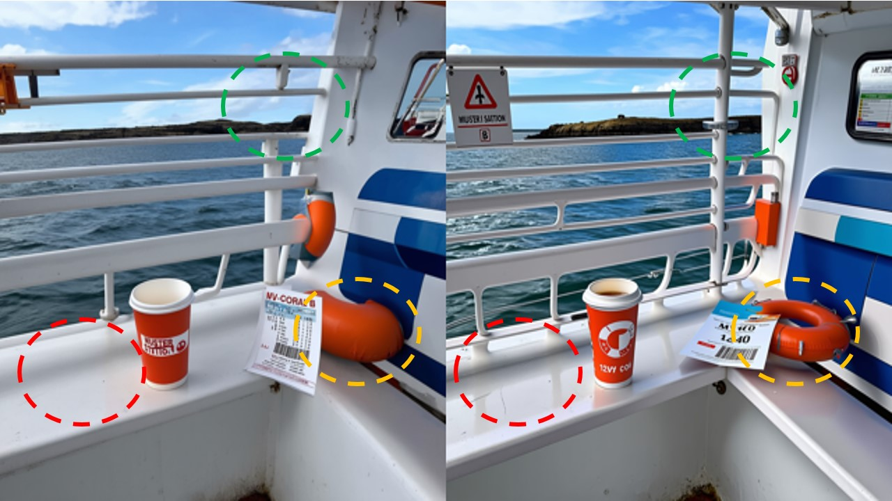

<div align="center">

# EMAG: Self-Rectifying Diffusion Sampling with Exponential Moving Average Guidance

**[Ankit Yadav](mailto:ankit.yadav@adelaide.edu.au), [Ta Duc Huy](mailto:huy.ta@adelaide.edu.au), [Lingqiao Liu](mailto:lingqiao.liu@adelaide.edu.au)**

Australian Institute for Machine Learning (AIML), Adelaide University, Australia

**ECCV 2026**

[](https://arxiv.org/abs/2512.17303)
[](https://github.com/drkkgy/EMAG)
[](LICENSE)
[](https://www.python.org/downloads/)

</div>

> **TL;DR** — EMAG is a *training-free* guidance method that perturbs the self-attention of a
> diffusion transformer with an **exponential moving average of its own attention map**, creating
> *hard, semantically-faithful negatives* and adaptively picking which layer to perturb — improving
> **HPS by +0.54 over CFG** and composing with APG/CADS.

<p align="center">
  
</p>

**Fig. 1 — CFG (left) vs. EMAG (right).** Compared to CFG, EMAG produces more *semantically plausible*
images: it preserves global structure while sharpening fine details and suppressing minor artifacts
(see the highlighted life-ring, cup text, and signage). Shown on SD3-Medium.

<!-- Project page: coming soon · ECCV 2026 proceedings link: TBA -->

## Abstract

In diffusion and flow-matching generative models, guidance techniques are widely used to improve
sample quality and consistency. Classifier-free guidance (CFG) is the de facto choice in modern
systems and achieves this by contrasting conditional and unconditional samples. Recent work explores
contrasting negative samples at inference using a weaker model — via strong/weak model pairs,
attention-based masking, stochastic block dropping, or perturbations to the self-attention energy
landscape. While these strategies refine generation quality, they still lack reliable control over
the granularity or difficulty of the negative samples, and target-layer selection is often fixed.
We propose **Exponential Moving Average Guidance (EMAG)**, a training-free mechanism that modifies
attention at inference time in diffusion transformers, with a **statistics-based, adaptive
layer-selection rule**. Unlike prior methods, EMAG produces harder, semantically faithful negatives
(fine-grained degradations), surfacing difficult failure modes and enabling the denoiser to refine
subtle artifacts — boosting the human preference score (**HPS by +0.54 over CFG**). EMAG also
naturally composes with advanced orthogonal guidance techniques such as **APG** and **CADS**.

## Installation

```bash
git clone https://github.com/drkkgy/EMAG.git
cd EMAG
pip install -r requirements.txt        # dependencies
pip install -e .                       # install the `emag` package (recommended)
huggingface-cli login                  # SD3-Medium weights are gated on Hugging Face
```

`pip install -e .` makes the `emag` package importable everywhere, so the scripts run from any
directory. Without it, run scripts from the repo root with `PYTHONPATH=.`, e.g.
`PYTHONPATH=. python scripts/quickstart.py ...`.

> **Tested environment:** Python 3.10, **torch 2.3.1**, **diffusers 0.31.0**, transformers 4.4x
> (CUDA 11.8 / 12.x). The SD3 pipeline was written against the diffusers 0.31.0 API — newer or
> older diffusers can rename/move imports (e.g. `SD3IPAdapterMixin`, `SD3LoraLoaderMixin`) and may
> break the pipeline. If you hit an `ImportError` from `diffusers`, run `pip install diffusers==0.31.0`.

## Quickstart

**Stable Diffusion 3 Medium (text-to-image):**

```bash
python scripts/quickstart.py \
    --prompt "a photograph of an astronaut riding a horse" \
    --cfg_scale 7 --emag_scale 1.5 --emag_layers 6 7 8 \
    --emag_adaptive_mode 2 --seed 8 --out emag_sd3.png
```

The default variant is **EMAG-Q** (`--method emag-q`: query-EMA + fused SDPA, ~half the overhead of
full EMAG). Pass `--method emag` for the full attention-map variant.

**DiT-XL/2 (class-conditional ImageNet, DDP):**

```bash
cd dit && torchrun --nproc_per_node=1 sample_emag_ddp.py \
    --model DiT-XL/2 --image-size 256 --num-fid-samples 50000 \
    --use_emag --emag_mode cond --emag_scale 3 --emag_layers 12 13 14 15 \
    --emag_start_step 150 --emag_time_delta 50 --emag_adaptive_mode 2 --global-seed 8
```

## Results

Headline SD3 text-to-image numbers on the **COCO 2014 validation set** (Table 2 of the paper).
The bottom block shows EMAG composed with orthogonal guidance (APG / CADS). Lower FID is better;
higher HPS (HPS v2, ×100) is better. `±` is std over 3 seeds.

| Guidance             | FID ↓      | HPS ↑           |
|----------------------|------------|-----------------|
| No guidance          | 23.859     | 21.61 ± 0.11    |
| CFG (baseline)       | 22.877     | 29.22 ± 0.05    |
| SAG + CFG            | 23.039     | 29.28 ± 0.04    |
| SEG + CFG            | 23.453     | 29.25 ± 0.04    |
| APG                  | 21.816     | 29.45 ± 0.02    |
| CADS                 | **18.320** | 28.36           |
| S²                   | 20.821     | 29.15 ± 0.00    |
| ERG                  | 23.989     | 29.35 ± 0.03    |
| **EMAG-I** (ours)    | 22.154     | 29.56           |
| **EMAG** (ours)      | 22.890     | 29.76 ± 0.03    |
| **EMAG-Q** (ours)    | 23.530     | 29.64           |
| **EMAG + APG**       | 21.819     | **29.79 ± 0.04**|
| **EMAG + CADS**      | 19.950     | 28.86 ± 0.02    |
| **EMAG-Q + APG**     | 22.480     | 29.77           |
| **EMAG-Q + CADS**    | 20.030     | 28.96           |

<sub>**EMAG-I** perturbs both image→image and image→text attention (default); **EMAG-Q** tracks the
EMA over query embeddings (perturbs queries only) to enable fused attention and cut overhead — see §3.4.</sub>

**Exact evaluation protocol.**
- **SD3-Medium (text-to-image):** COCO-2014 validation captions, **40K** samples (one image per
  caption), **28** sampling steps, **1024×1024**, **seed 8**. Metrics: HPS v2 (×100), FID; plus
  Precision/Recall/Density/Coverage and CLIPScore in the paper. Per-method scales are chosen from
  each method's FID–HPS **Pareto frontier** (paper §D).
- **DiT-XL/2 (class-conditional):** ImageNet-1K labels, **50K** samples, **256×256** (and 512×512),
  **seed 8**; FID/PRDC computed against the official ADM reference statistics.

Class-conditional (DiT) and unconditional PRDC tables are in the paper (Tables 3, S8, S9).

## Layer selection

The recommended per-backbone defaults (β, EMAG/CFG scale, layer range, start/delta, steps, seed) are
baked into the scripts — `scripts/quickstart.py` (SD3) and `dit/sample_emag_ddp.py` (DiT); see the
paper for the full hyperparameter study.

EMAG perturbs only middle blocks —
`(l_min, l_max) = (6, 8)` for SD3 and `(12, 15)` for DiT. At each timestep it selects the single
layer with the largest **attention gradient**

$$\ell_t^\star = \arg\max_{n \in \{l_{\min},\dots,l_{\max}\}} \Delta_t^{(n)}, \qquad \Delta_t = \mathrm{MAE}(E_t, A_t) = \tfrac{1}{|A_t|}\sum_i \big| E_t^{(i)} - A_t^{(i)} \big|,$$

i.e. the layer whose live attention $A_t$ deviates most from its EMA $E_t$ (the one actively
inserting high-frequency content), and hard-replaces that layer's attention with its EMA using a
convex blend $\tilde{A}_t = (1-\lambda)A_t + \lambda E_t$ with $\lambda = 1$ (paper §3.4, Eq. 11–13).

## Compute & timing

Wall-clock on a **single NVIDIA A100-SXM4-40GB**, SD3-Medium at 1024×1024, 28 steps, batch size 1,
averaged over 45 images after 5 warmup iterations (Table 4). Overhead is relative to vanilla CFG.

| Method            | s / image | Overhead | Peak Mem   | FID / HPS       |
|-------------------|-----------|----------|------------|-----------------|
| CFG (baseline)    | 4.04      | –        | 16.89 GB   | 22.88 / 29.22   |
| SEG + CFG         | 6.05      | +49.6 %  | 18.76 GB   | 23.45 / 29.25   |
| SAG + CFG         | 7.22      | +78.5 %  | 24.85 GB   | 23.04 / 29.28   |
| **EMAG** (ours)   | 12.66     | +213.2 % | 29.58 GB   | 22.89 / **29.76** |
| **EMAG-Q** (ours) | 7.86      | +94.5 %  | 16.96 GB   | 23.53 / 29.64   |

**EMAG-Q** keeps most of the quality gain (+0.42 HPS over CFG) while roughly halving EMAG's overhead
and returning peak memory to the CFG baseline — recommended when compute is tight.

## Reproducing Table 2 (SD3, COCO-2014)

Reproduces the EMAG rows — **EMAG** and **EMAG-Q**, each as EMAG-only / **+APG** / **+CADS** — and
computes FID + HPS v2 for every config. Self-contained (no EvalGIM); needs `pytorch-fid` + `hpsv2`,
a GPU, and gated SD3 access (`huggingface-cli login`).

```bash
CAPTIONS=/data/coco/annotations/captions_val2014.json \
FID_REF=/data/coco/val2014 \
OUT=outputs/table2 NUM_SAMPLES=40000 \
bash scripts/reproduce_table2.sh
```

This writes `outputs/table2/table2_results.csv` (per-config FID / HPS mean / HPS median). Under the
hood: `scripts/generate_coco.py` (batch generation → `index.json`), then `python -m eval.fid` and
`python -m eval.hps`. Table 2 uses Pareto-selected per-config scales (paper §D); override the default
via `EMAG_SCALE=<w_e>` to hit exact Pareto points. Run a single config directly, e.g.:

```bash
python scripts/generate_coco.py --captions "$CAPTIONS" --out_dir outputs/emag_q \
    --method emag-q --combo_mode APG --num_samples 40000
python -m eval.fid --run outputs/emag_q --ref /data/coco/val2014
python -m eval.hps --run outputs/emag_q
```

## Repository layout

```
emag/           SD3 (MMDiT) EMAG package: attention/query EMA processor + adaptive layer selection
dit/            DiT-XL/2 class-conditional path (flat layout — run scripts from inside dit/)
scripts/        quickstart.py (single-image demo), generate_coco.py, reproduce_table2.sh
eval/           self-contained metrics: fid.py (pytorch-fid), hps.py (HPS v2)
tests/          unit tests for the SD3 (incl. EMAG-Q) and DiT EMAG attention cores
```

## Roadmap / TODO

- [x] EMAG-Q variant (query-EMA + fused SDPA) — default in `scripts/quickstart.py`.
- [x] Table 2 (EMAG rows) reproduce: `scripts/generate_coco.py` + `eval/fid.py` + `eval/hps.py` +
  `scripts/reproduce_table2.sh`.
- [ ] **Hugging Face integration:** package the SD3 EMAG pipeline as a 🤗 diffusers *community
  pipeline* so it loads via `DiffusionPipeline.from_pretrained(..., custom_pipeline="emag")`, and
  publish a model card / demo on the Hub.
- [ ] Add `TESTING.md` documenting the GPU validation sequence (unit tests → quickstart → DiT → eval
  → full Table 2).
- [ ] README: pin exact tested versions / add a conda `environment.yml`.

## Citation

```bibtex
@inproceedings{yadav2026emag,
  title     = {EMAG: Self-Rectifying Diffusion Sampling with Exponential Moving Average Guidance},
  author    = {Yadav, Ankit and Huy, Ta Duc and Liu, Lingqiao},
  booktitle = {Proceedings of the European Conference on Computer Vision (ECCV)},
  year      = {2026}
}
```

## Acknowledgements

The SD3 pipeline builds on 🤗 [diffusers](https://github.com/huggingface/diffusers); the DiT path
builds on [facebookresearch/DiT](https://github.com/facebookresearch/DiT). Baseline comparisons draw
on the public implementations of APG, CADS, PAG, SAG, SEG, ERG and S². Evaluation uses
[EvalGIM](https://arxiv.org/abs/2412.10604) and HPS v2.

## License

Released under the [Apache License 2.0](LICENSE).

## Contact

Questions and issues welcome via [GitHub Issues](https://github.com/drkkgy/EMAG/issues) or
`ankit.yadav@adelaide.edu.au`.
